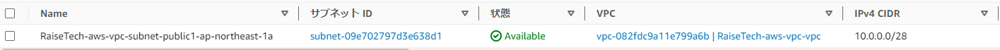
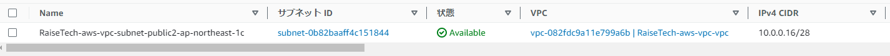
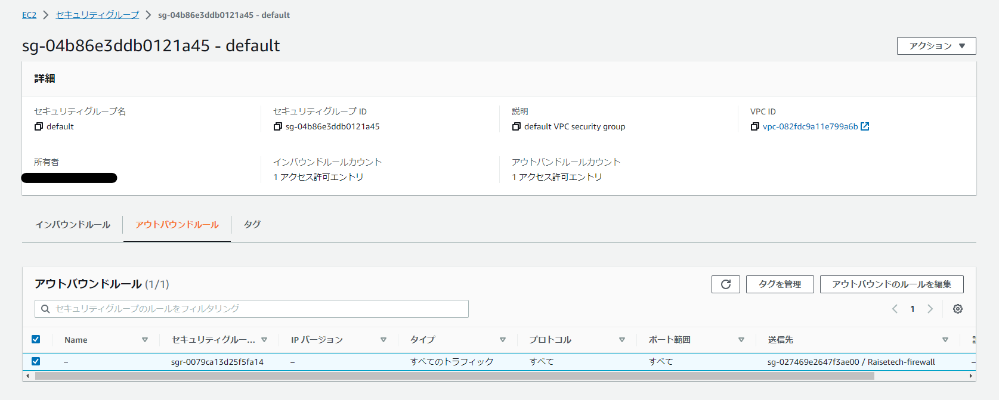
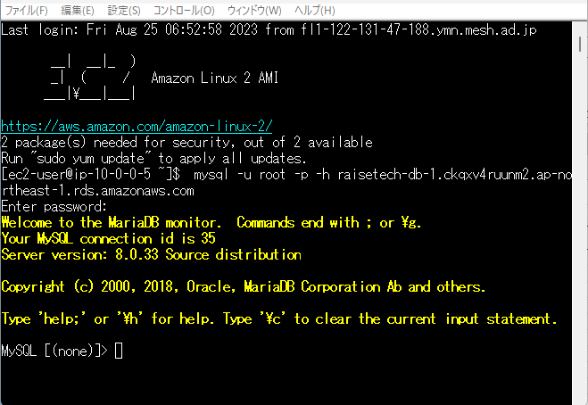

# AWSフルコース第四回課題について

## VPCとEC2とRDSの構築
AWSでVPCを立ち上げて、EC2とRDSを構築して接続の確認をする

**VPC作成**
- CIDRブロック(利用できるIPアドレスの範囲)10.0.0.0/24
- AZを二つ作成し、その中にパブリックサブネットとプライベートサブネットを各一つ作成
  

**サブネット構成の確認**
- サブネットの確認をすると、同じVPCのサブネットの異なるAZに存在する
- vpc(RaiseTech-aws-vpc-vpc)
- AZ1(ap-northeast-1a)
- AZ2(ap-northeast-1c)
- 各AZにパブリックサブネットとプライベートサブネット配置されている

**EC2を作成**
- Vpc(RaiseTech-aws-vpc-vpc) 
- Subnet(RaiseTech-aws-vpc-subnet-public1-ap-northeast-1a) 
- SecurityGroup(Raisetech-firewall)
- AZ1(ap-northeast-1a)内のパブリックサブネットに作成されていることがわかる

- SecurityGroup(Raisetech-firewall)となっている

**RDSを作成**
- AZ(ap-northeast-1a)内であることわかる
- SecurityGroup(default)となっている

- SubnetGroup(下記のサブネット内に配置が可能である)
    - RaiseTech-aws-vpc-subnet-public1-ap-northeast-1a
        
    - RaiseTech-aws-vpc-subnet-private1-ap-northeast-1a
        
    - RaiseTech-aws-vpc-subnet-public2-ap-northeast-1c
        
    - RaiseTech-aws-vpc-subnet-private2-ap-northeast-1c
        

**セキュリティグループ**
- EC2のセキュリティグループのインバウンドで許可しているMySQLのソースは10.0.0.128/28  
であり、同じAZのプライベートサブネットからの通信を許可している

- RDSのセキュリティグループの許可しているインバウンドとアウトバウンドはEC2のセキュリティグループを適用しているソースからの通信を許可している  

## EC2にアクセスしてRDSに接続できる確認

**TeraTermからEC2にSSH接続してMySQLに接続**

**RDS接続してる状態の確認**
 
**RDS接続を切断した場合の確認**
