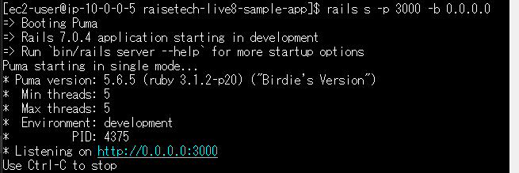
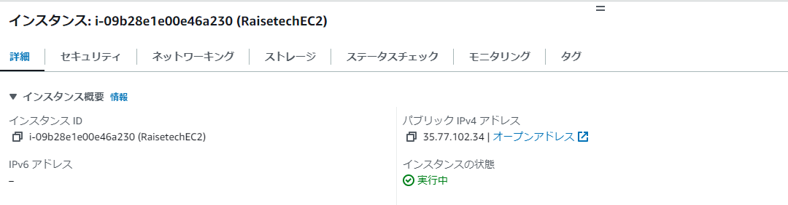
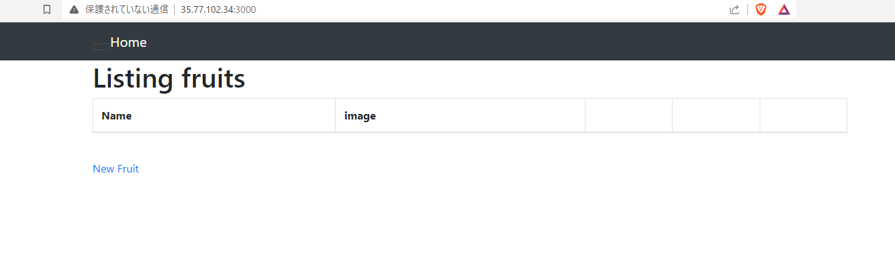

# AWSフルコース第五回課題

## EC2にRailsのサンプルアプリをデプロイして動作

### 組み込みサーバーで動作させる

**EC2でPumaを立ち上げる**

**EC2のパブリックIPアドレスを確認**

**<EC2のパブリックIP>：3000でアプリの動作を確認**

###　NginxとUnicornにわけて動作させる

## 課題を勧めるうえで調べたこと
### Pumaとその役割

PumaはRuby on Railsの組み込みサーバーであり、APサーバーとしての役割を果たす。しかし、Pumaはマルチスレッドとマルチプロセスをサポートしているため、一定程度のWebサーバーとしての機能も持っている。そのため、開発環境や小規模な本番環境では、PumaだけでWebサーバーとAPサーバーの両方の役割を果たすことが可能。

### Nginx

Nginxは、高性能なWebサーバー、リバースプロキシ、メールプロキシ、一般的なTCP/UDPプロキシなどとして使用されるソフトウェア。  
Webサーバーの主な役割は、クライアント（通常はWebブラウザ）からのHTTPリクエストを受け取り、適切なレスポンス（通常はHTMLファイルや静的ファイル）を返すこと。Nginxはリバースプロキシとしても機能し、受け取ったリクエストをバックエンドのAPサーバーに転送する。

#### 主な特徴
- **高性能と高い並行処理能力**
    Nginxは非同期イベント駆動アーキテクチャを採用しているため、多数の同時接続を効率よく処理でき、少ないサーバーリソースで多くのリクエストを処理することが可能。
- **リバースプロキシと負荷分散機能**
    リバースプロキシとは、クライアントからのリクエストをバックエンドのサーバーに転送し、そのレスポンスをクライアントに返す役割。Nginxは設定により複数のバックエンドサーバーにリクエストを均等に分散する負荷分散もできる。
- **キャッシュと圧縮機能**
    よくアクセスされるコンテンツをキャッシュして高速に配信することができる。また、データを圧縮することでネットワーク帯域を節約しレスポンス速度を向上させることができる。
- **SSL/TLSサポート**
    SSL（Secure Sockets Layer）およびTLS（Transport Layer Security）は、インターネット上でデータを暗号化して安全に送受信するためのプロトコル。これにより安全なデータ通信が可能。
- **設定が柔軟で拡張性が高い**
    設定ファイルが柔軟で、多くのパラメータをカスタマイズできる。また、モジュールを追加することで、さまざまな拡張機能を利用することができる。

### Unicorn

Unicornは、RackインターフェースをサポートするHTTPサーバーであり、主にRubyのWebアプリケーション（特にRuby on Railsアプリケーション）で使用される。  
UnicornはAP（アプリケーション）サーバーとして使用される。APサーバーの主な役割は、具体的なアプリケーションロジックを処理すること。これはデータベースとのやり取り、ビジネスロジックの実行、動的なHTMLコンテンツの生成など。Rubyのアプリケーションでよく使用される。

#### 主な特徴
- **プリフォークモデルによる並行処理**
    マスタープロセスが複数のワーカープロセスを事前に生成（プリフォーク）する方式。各ワーカープロセスは独立してリクエストを処理するため、並行処理が可能。
- **グレースフルリスタートとゼロダウンタイムデプロイメント**
    新しい設定を適用するか、新しいバージョンのアプリケーションに更新する際に、既存の接続を中断することなく行える機能。これにより、「ゼロダウンタイムデプロイメント」が可能となり、サービスの中断なく更新が行えます。
- **Rackインターフェースのサポート**
    RackとはRubyで作られたフレームワーク（Railsやsinatra）とWebサーバーを繋ぐためのインターフェース。WebサーバーからのリクエストをRailsに伝え、そのレスポンスをwebサーバーへ返す仲介役。

### NginxとUnicornの連携

NginxとUnicornはよく一緒に使用される。Nginxがリバースプロキシとして動作し、外部からのリクエストをUnicornのワーカープロセスに転送する。この組み合わせにより、高いパフォーマンスと柔軟なスケーリングが可能になる。

- **Nginx**: 高速な静的ファイルの配信、SSL終端、キャッシュ、負荷分散など
- **Unicorn**: Rubyアプリケーションの具体的なビジネスロジックを処理

#### 連携の例

1. クライアントがWebサイトにアクセスすると、最初にNginx（Webサーバー）にリクエストが行く。
2. Nginxは静的なコンテンツ（例：CSS、JavaScript、画像ファイル）に対するリクエストならば、そのファイルを直接クライアントに返す。
3. 動的なコンテンツ（例：ユーザーのプロフィールページ、商品の詳細ページ）に対するリクエストは、Unicorn（APサーバー）に転送される。
4. Unicornはリクエストに応じてアプリケーションロジックを処理し、生成されたHTMLをNginxを通してクライアントに返す。

それぞれ異なる層で動作し、連携してWebアプリケーションを高速かつ効率的に提供する。
NginxとUnicornは一緒に使用することでWebアプリケーションのパフォーマンスと可用性を高める。

### ELBとは？
- Elastic Load Balancingの略で、AWSが提供するロードバランサー  
- サーバーに集中するアクセス(トラフィック)を、複数のサーバーやネットワークに振り分けて、負荷を分散する仕組み
- 1つの負荷を分散させるので、負荷分散装置とも言われる
- ヘルスチェック機能も備えており、リアルタイムでサーバーのパフォーマンスをモニタリングすることができる
- 異常のあるサーバーを見つけるとそのサーバーへのトラフィック送信を中止し、他の正常な状態のサーバーにトラフィックを送信し、負荷分散する
- 負荷を自動的に分散し、サーバーがダウンしてしまうのを防いでくれる役割
- 負荷の状態に応じて自動的にスケーリングを行い、管理者が手動でELBの台数を増やしたり、スペックを上げたりする手間も必要ない
- 突然アクセスが増加するなどのトラフィック上昇が予測される場合は、AWS Auto Scalingと併用することも可能
- リクエスト量に合わせたサーバーの増減が可能となり、サーバーダウンを防ぐことができる
- アベイラビリティゾーンが違う場合にも、設置されているEC2のトラフィックを負荷分散させることができる

### S3とは？
- Amazon Simple Storage Service (Amazon S3) というオブジェクトストレージサービス
- データは「バケット」と呼ばれるリソース内のオブジェクトで保存され、オブジェクトあたりのサイズは最大5TB
- オブジェクトにメタデータタグを追加する機能
- S3 ストレージクラス全体でデータを移動および保存する機能
- データアクセス制御を設定および実施する機能
- アクセス許可のないユーザーからデータを保護する機能
- ビッグデータ分析を実行する機能
- オブジェクトおよびバケットレベルでデータをモニタリングする機能
- 組織全体におけるストレージの使用状況およびアクティビティの傾向を表示する機能

##### S3 バッチオペレーション
Amazon S3 マネジメントコンソールからの数回クリックにより、または単一の API リクエストによって、数十億個ものオブジェクトを大規模に管理できる。

### まとめ

- **Puma**: WebサーバーとAPサーバーの両方の基本的な機能を持っているため、単独で使用することができる。
- **Nginx + Unicorn**: 組み合わせて使用すること、それぞれが得意とする領域で機能。それぞれ単独での利用も可能。
大規模な本番環境や特定のパフォーマンス要件がある場合には、NginxとUnicorn（またはPuma）を組み合わせて使用することが一般的。Nginxが高度なリバースプロキシとして動作し、PumaやUnicornがアプリケーションロジックを処理。このようにして、各ソフトウェアの長所を最大限に活かす。

- **ELB**: AWSが提供するロードバランサー。サーバーのパフォーマンスをモニタリングし、負荷の分散を自動的に行ってサーバーダウンを防ぐ