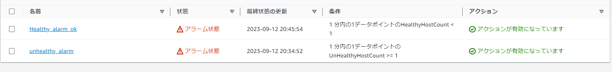
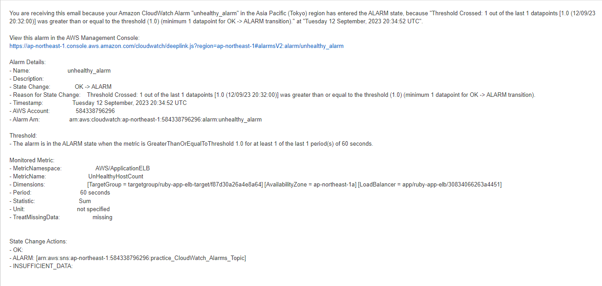
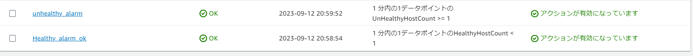
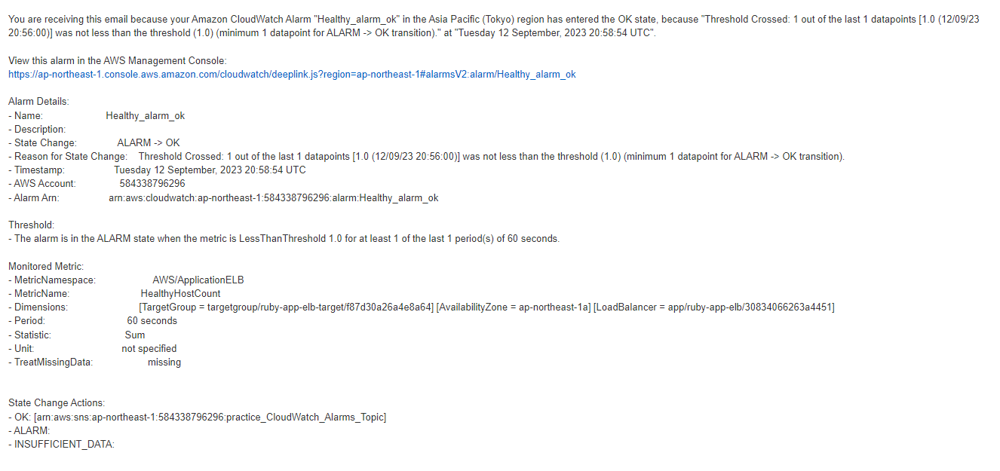
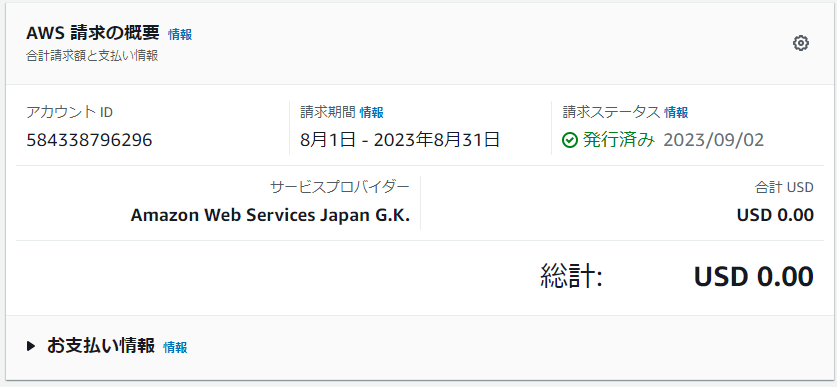
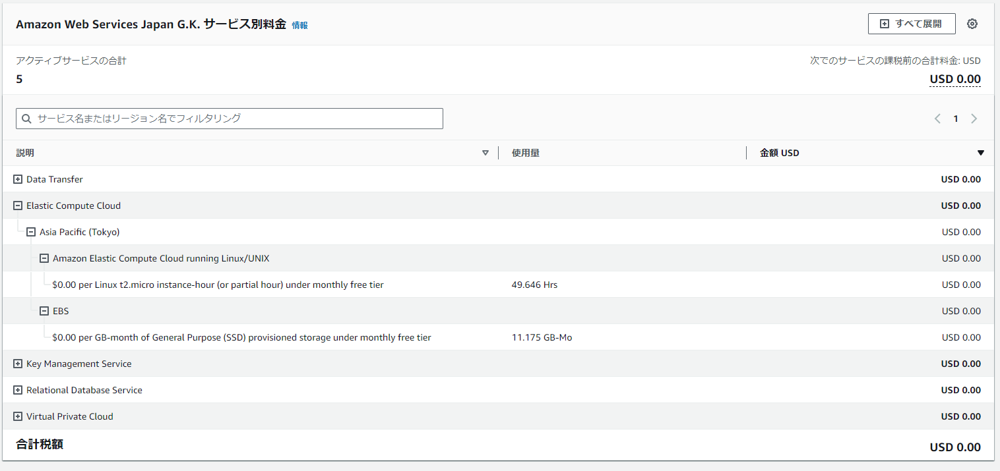

# AWSフルコース第六回課題

## Cloud trail
### イベント名と含まれている内容を3つピックアップ
- PutMetricAlarm
    - "eventTime": "2023-09-12T19:28:32Z"
    - "requestParameters": {
        "alarmName": "ALB_unhealthy",
        "alarmDescription": "albがunhealthyになったことを通知します",
        "actionsEnabled": true,
        "oKActions": [],
        "alarmActions": [
            "arn:aws:sns:ap-northeast-1:584338796296:practice_CloudWatch_Alarms_Topic"
        ]
    - "metricName": "HealthyHostCount"

CloudWatchでメトリクスアラームを設定したイベントが記録されている。
イベントの時間や設定したパラメータや、メトリクス名など読み取れる。
その他IAMユーザー名やソース元のIPアドレス、AWSアクセスキーなどイベントに関係する内容が記録されている。

### CloudWatchでアラームの設定
- Unicornを停止してアプリにアクセスできない状態にしたとき
    ダッシュボード
    

    通知メール
    

- Unicornを起動してアプリにアクセスできる状態にしたとき
    ダッシュボード
    

    通知メール
    

### Pricing calculaterでリソース利用料の見積り作成
[見積へのリンク](https://calculator.aws/#/estimate?id=3f1ec588a6820fa05824d3c0dca652ca63877965)

**追記**
- EC2の見積にEBSを追加
- ELBの見積からLamda利用の項目を削除
[修正見積へのリンク](https://calculator.aws/#/estimate?id=b1e62e0138b163512f2c86b2e03f07aeaba460b2)

### マネジメントコンソールから自分の請求の確認
**先月の請求とEC2のコスト**

