# AWSフルコース第十回課題

## CloudFormationで構築を自動化する
- jsonまたはyaml形式でテンプレートを作成
- 作成したテンプレートでスタックを作成
- エラーになった場合はロールバックで全てのリソースが削除される
- スタックのみ残るため、エラー内容確認後消去しないと同じ名前のスタックは作成できない
- リソースをコードに落とし込むので、gitで差分管理ができる

### 実際の構築手順
**自分の環境でどのようにテンプレートを作成したかメモ**
1. ローカルにテンプレートを管理するためのリポジトリを作成
2. VScodeの拡張機能でスニペットが利用できるCloudFormationインストール
3. テンプレートの文法をチェックできるCloudFormationLinterをインストール
4. インデントが見やすくなるVScodeの拡張機能rainbow-indentをインストール
5. Python(pip)とcfn-lintをインストール(CloudFormationLinter利用に必要)
6. <ファイル名>.ymlを作成 
7. 以前作成したリソースや環境構成図を参考にコーディング
    **コーディングポイントメモ**
    - AWSTemplateFormatVersion: "2010-09-09"現在使えるバージョンはこれだけ。お作法
    - クロススタック参照を使用して共有リソースを参照することでテンプレートを分割できる
    - 固有のパラメータは組み込み関数
    - 依存関係を明示的に定義しないとリソース作成失敗したり、削除失敗する
    - UserDataセクションにリソース立ち上げ時に実行するコマンドを定義できる
### 構築とコード
**テンプレートの説明と作成時のインプットパラメータ定義**
- パラメータにはバリデーションを実装

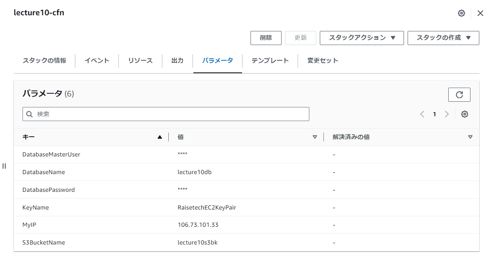 
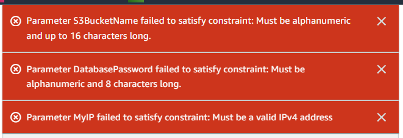

```yaml
AWSTemplateFormatVersion: "2010-09-09"

Description: 'Template for assignment for RaiseTech 10th lecture'

#Input Parameters
Parameters: 
  KeyName:
    Description: The EC2 Key Pair to allow SSH access to the instance
    Type: AWS::EC2::KeyPair::KeyName
    
  MyIP:
    Description: IP address allowed to access EC2
    Type: String
    AllowedPattern: "^((25[0-5]|2[0-4][0-9]|1[0-9][0-9]|[1-9]?[0-9])\\.){3}(25[0-5]|2[0-4][0-9]|1[0-9][0-9]|[1-9]?[0-9])$"
    ConstraintDescription: Must be a valid IPv4 address 
  
  DatabaseName:
    Description: DBname for the RDS database instance
    Type: String
    MinLength: '1'
    MaxLength: '16'
    AllowedPattern: '^[a-zA-Z0-9]+$'
    ConstraintDescription: Must be alphanumeric and up to 16 characters long.
  
  DatabaseMasterUser:
    Description: Username for the RDS database instance
    Type: String
    NoEcho: true
    MinLength: '1'
    MaxLength: '6'
    AllowedPattern: '^[a-zA-Z]+$'
    ConstraintDescription: Must be alphabetic and up to 6 characters long.
  
  DatabasePassword:
    Description: Password for the RDS database instance
    Type: String
    NoEcho: true
    MinLength: '6'
    MaxLength: '8'
    AllowedPattern: '^[a-zA-Z0-9]+$'
    ConstraintDescription: Must be alphanumeric and 8 characters long.
  
  S3BucketName:
    Description: S3 bucket name
    Type: String
    MinLength: '1'
    MaxLength: '16'
    AllowedPattern: '^[a-zA-Z0-9]+$'
    ConstraintDescription: Must be alphanumeric and up to 16 characters long.
``` 
  
**VPCの作成**

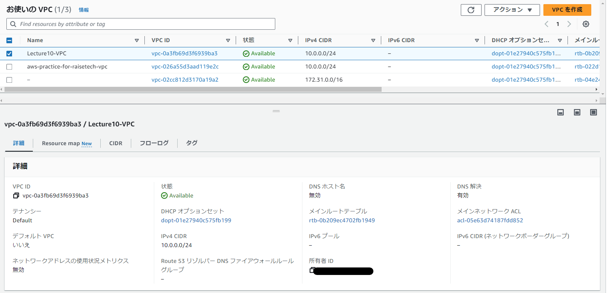

```yaml
#Creating a VPC
  Lecture10VPC:
    Type: AWS::EC2::VPC
    Properties:
      CidrBlock: 10.0.0.0/24
      Tags:
        - Key: Name
          Value: Lecture10-VPC
```
  
**インターネットゲートウェイの作成**
- IGWを作成
- 先に作ったVPCにアタッチ
- !Ref <論理ID>で構築したリソースのIDを紐付けることが出来る 
　


```yaml
  #Creating an IGW
  Lecture10IGW:
    Type: AWS::EC2::InternetGateway
    Properties:
      Tags:
        - Key: Name
          Value: Lecture10IGW

  #Attach IGW and VPC
  Lecture10AttachIGW:
    Type: AWS::EC2::VPCGatewayAttachment
    Properties:
      InternetGatewayId : !Ref Lecture10IGW
      VpcId: !Ref Lecture10VPC
```
  
**ルートテーブルとパブリックサブネット作成**
- パブリックサブネットを二つ作成
- 作成したルートテーブルに2つのパブリックサブネットを紐付ける

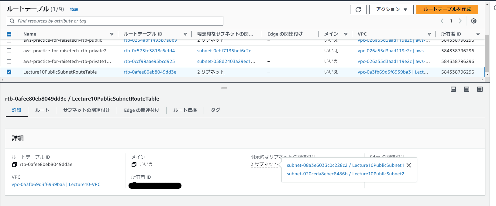

```yaml
  #Route table for public subnets
  Lecture10PublicSubnetRouteTable:
    Type: AWS::EC2::RouteTable
    DependsOn:
        - Lecture10AttachIGW
    Properties:
      VpcId: !Ref Lecture10VPC
      Tags:
        - Key: Name
          Value: Lecture10PublicSubnetRouteTable

  #Public Subnet Creation
  Lecture10PublicSubnet1:
    Type: AWS::EC2::Subnet
    Properties:
      CidrBlock: 10.0.0.0/28
      MapPublicIpOnLaunch: true
      VpcId: !Ref Lecture10VPC
      AvailabilityZone: 
        Fn::Select: 
          - 0
          - Fn::GetAZs: ""
      Tags:
        - Key: Name
          Value: Lecture10PublicSubnet1

  Lecture10PublicSubnet2:
    Type: AWS::EC2::Subnet
    Properties:
      CidrBlock: 10.0.0.16/28
      MapPublicIpOnLaunch: true
      VpcId: !Ref Lecture10VPC
      AvailabilityZone: 
        Fn::Select: 
          - 1
          - Fn::GetAZs: ""
      Tags:
        - Key: Name
          Value: Lecture10PublicSubnet2

  #Connect the route table to the public subnet
  Lecture10AssocciateRouteTableForPublicSubnet1:
    Type: AWS::EC2::SubnetRouteTableAssociation
    Properties:
      RouteTableId: !Ref Lecture10PublicSubnetRouteTable
      SubnetId: !Ref Lecture10PublicSubnet1
  
  Lecture10AssocciateRouteTableForPublicSubnet2:
    Type: AWS::EC2::SubnetRouteTableAssociation
    Properties:
      RouteTableId: !Ref Lecture10PublicSubnetRouteTable
      SubnetId: !Ref Lecture10PublicSubnet2
  
  #Connect public subnet route table with IGW
  Lecture10PublicSubnetRoute:
    Type: AWS::EC2::Route
    DependsOn:
        - Lecture10AttachIGW
    Properties:
      RouteTableId: !Ref Lecture10PublicSubnetRouteTable
      DestinationCidrBlock: 0.0.0.0/0
      GatewayId: !Ref Lecture10IGW
```
  
**プライベートサブネットとルートテーブル構築**
- プライベートサブネットはルートテーブルを2つ作って別々に接続
- 今後のプライベートサブネットの使い方の幅を広げるため

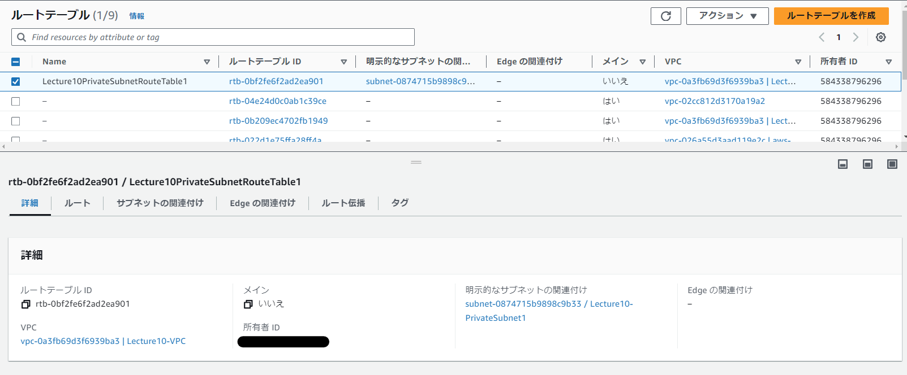
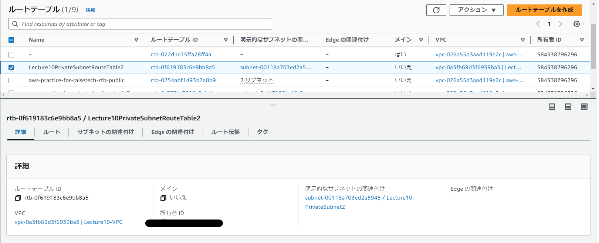

```yaml
 #Private subnets have separate tables to allow flexibility in accessing each resource.
  Lecture10PrivateSubnetRouteTable1:
    Type: AWS::EC2::RouteTable
    Properties:
      VpcId: !Ref Lecture10VPC
      Tags:
        - Key: Name
          Value: Lecture10PrivateSubnetRouteTable1
  
  Lecture10PrivateSubnetRouteTable2:
    Type: AWS::EC2::RouteTable
    Properties:
      VpcId: !Ref Lecture10VPC
      Tags:
        - Key: Name
          Value: Lecture10PrivateSubnetRouteTable2

  #Create private subnet
  Lecture10PrivateSubnet1:
    Type: AWS::EC2::Subnet
    Properties:
      CidrBlock: 10.0.0.128/28
      MapPublicIpOnLaunch: false
      VpcId: !Ref Lecture10VPC
      AvailabilityZone: 
        Fn::Select: 
          - 0
          - Fn::GetAZs: ""
      Tags:
        - Key: Name
          Value: Lecture10-PrivateSubnet1

  Lecture10PrivateSubnet2:
    Type: AWS::EC2::Subnet
    Properties:
      CidrBlock: 10.0.0.144/28
      MapPublicIpOnLaunch: false
      VpcId: !Ref Lecture10VPC
      AvailabilityZone: 
        Fn::Select: 
          - 1
          - Fn::GetAZs: ""
      Tags:
        - Key: Name
          Value: Lecture10-PrivateSubnet2

  #Connect private subnets and route tables
  Lecture10AssocciateRouteTableForPrivateSubnet1:
    Type: AWS::EC2::SubnetRouteTableAssociation
    Properties:
      RouteTableId: !Ref Lecture10PrivateSubnetRouteTable1
      SubnetId: !Ref Lecture10PrivateSubnet1
  
  Lecture10AssocciateRouteTableForPrivateSubnet2:
    Type: AWS::EC2::SubnetRouteTableAssociation
    Properties:
      RouteTableId: !Ref Lecture10PrivateSubnetRouteTable2
      SubnetId: !Ref Lecture10PrivateSubnet2
```
**ResourceMap**

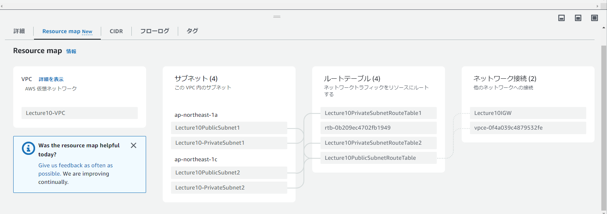

**ALBの構築**
- ALB用のセキュリティグループを作成
- myIPはパラメータで入力した値
- ALB本体とターゲットグループ、リスナーを作成

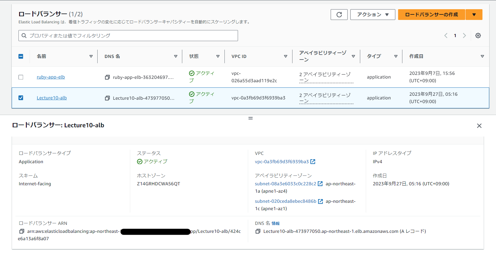
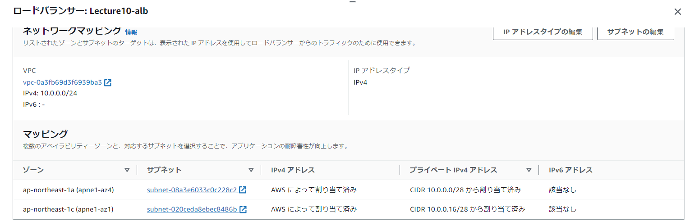
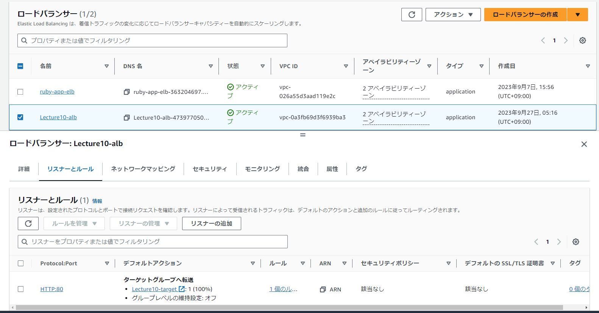
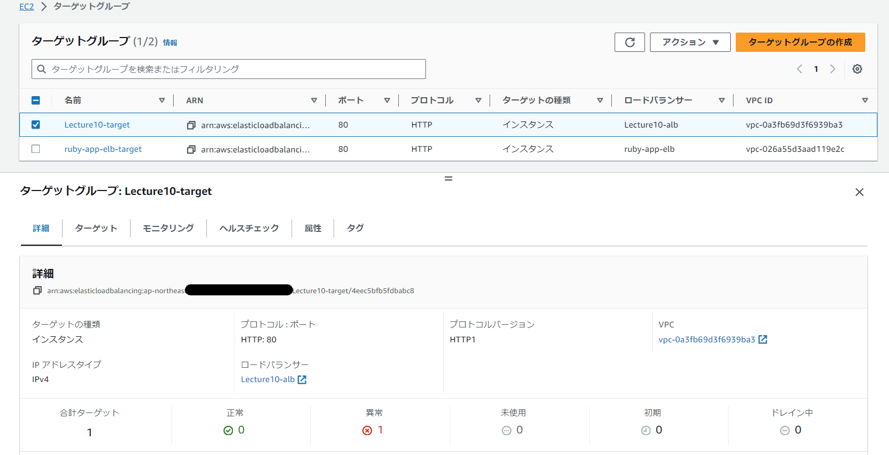

```yaml
#Create security group for ALB
  Lecture10SecGpForAlb:
    Type: AWS::EC2::SecurityGroup
    Properties:
      GroupName: alb-sec-lecture10
      GroupDescription: securitey for ec2 access
      VpcId: !Ref Lecture10VPC
      SecurityGroupIngress:
        - IpProtocol: tcp
          FromPort: 80
          ToPort: 80
          CidrIp: !Ref MyIP
      Tags:
        - Key: Name
          Value: Lecture10SecGpForAlb 

  #Create ALB
  Lecture10Alb:
    Type: AWS::ElasticLoadBalancingV2::LoadBalancer #ELB Configuration
    Properties:
      Name: "Lecture10-alb"
      Scheme: "internet-facing" #Load balancer is configured for the Internet; PubIP is assigned.
      Type: "application"
      Subnets: 
      - !Ref Lecture10PublicSubnet1
      - !Ref Lecture10PublicSubnet2
      SecurityGroups: 
      - !Ref Lecture10SecGpForAlb
      IpAddressType: "ipv4"
      Tags:
      -
        Key: "Name"
        Value: "Lecture10-alb"

  #Create target group
  Lecture10TargetGroup:
    Type: "AWS::ElasticLoadBalancingV2::TargetGroup"
    Properties:
      Name: "Lecture10-target"
      VpcId: !Ref Lecture10VPC
      Protocol: "HTTP"
      ProtocolVersion: "HTTP1"
      Port: 80
      TargetType: "instance"
      Targets: 
      - Id: !Ref Lecture10Ec2
        Port: 80
      HealthCheckEnabled: true
      HealthCheckIntervalSeconds: 30
      HealthCheckPath: "/"
      HealthCheckPort: "traffic-port"
      HealthCheckProtocol: "HTTP"
      HealthCheckTimeoutSeconds: 5
      HealthyThresholdCount: 5
      UnhealthyThresholdCount: 2
      Matcher: 
        HttpCode: "200"
      Tags:
      -
        Key: "Name"
        Value: "Lecture10-target"

#Listener Settings
  ListenerResource:
    Type: "AWS::ElasticLoadBalancingV2::Listener"
    Properties:
      LoadBalancerArn: !Ref Lecture10Alb
      Port: 80
      Protocol: "HTTP"
      DefaultActions: 
      - 
        TargetGroupArn: !Ref Lecture10TargetGroup
        Type: "forward"
```
  
**EC2とRDSのセキュリティグループを作成**
- 循環参照を避けるため、インバウンドルールとアウトバウンドルールを後から追加


```yaml
#Create security group for EC2
  Lecture10SecGpForEc2:
    Type: AWS::EC2::SecurityGroup
    Properties:
      GroupName: ec2-sec-lecture10
      GroupDescription: securitey for ec2 access
      VpcId: !Ref Lecture10VPC
      SecurityGroupIngress:
        - IpProtocol: tcp
          FromPort: 22
          ToPort: 22
          CidrIp: !Ref MyIP
      Tags:
        - Key: Name
          Value: Lecture10SecGpForEc2
  
  #Split rule definitions to avoid circular references
  SecurityGroupIgressForEc2: 
    Type: AWS::EC2::SecurityGroupIngress
    Properties:
      IpProtocol: tcp
      FromPort: 80
      ToPort: 80
      GroupId: !Ref Lecture10SecGpForEc2
      SourceSecurityGroupId: !Ref Lecture10SecGpForAlb
  
  #Add outbound rules to ALB security group
  SecurityGroupEgressForAlb:
    Type: AWS::EC2::SecurityGroupEgress
    Properties:
      IpProtocol: tcp
      FromPort: 80
      ToPort: 80
      GroupId: !Ref Lecture10SecGpForAlb
      DestinationSecurityGroupId: !Ref Lecture10SecGpForEc2

  #Create security group for RDS
  Lecture10SecGpForRds:
    Type: AWS::EC2::SecurityGroup
    Properties:
      GroupName: rds-sec-lecture10
      GroupDescription: securitey for rds access
      VpcId: !Ref Lecture10VPC
      SecurityGroupIngress:
        - IpProtocol: tcp
          FromPort: 3306
          ToPort: 3306
          SourceSecurityGroupId: !Ref Lecture10SecGpForEc2
      Tags:
        - Key: Name
          Value: Lecture10SecGpForRds

  #Add RDS outbound rules
  SecurityGroupEgressForRds:
    Type: AWS::EC2::SecurityGroupEgress
    Properties:
      IpProtocol: tcp
      FromPort: 3306
      ToPort: 3306
      GroupId: !Ref Lecture10SecGpForRds
      DestinationSecurityGroupId: !Ref Lecture10SecGpForEc2
```
  
**EC2にS3アクセスのためのロールを作成**
- IamInstanceProfileに紐付けるためのLecture10Ec2InstanceProfileを作成


```yaml
#Create EC2 IAM role
  Lecture10Ec2IamRole:
    Type: AWS::IAM::Role
    Properties:
      AssumeRolePolicyDocument:
        Version: "2012-10-17"
        Statement:
          - Effect: "Allow"
            Principal:
              Service: "ec2.amazonaws.com"
            Action: "sts:AssumeRole"
      Path: "/"
      ManagedPolicyArns:
        - arn:aws:iam::aws:policy/AmazonS3FullAccess

  Lecture10Ec2InstanceProfile:
    Type: 'AWS::IAM::InstanceProfile'
    Properties:
      Path: "/"
      Roles: 
        - !Ref Lecture10Ec2IamRole 
```
  
**EC2構築**
- MetadataセクションでAWS::CloudFormation::Initを使って設定ファイル作成を行っている
- UserDataセクションで必要なクライアントなどをインストールしている
- DependsOn: Lecture10RdsでRDSが構築されてから構築を開始する
- RDSのエンドポイントが作成されてからEC2が構築されるようuntil nc -z ${Lecture10Rds.Endpoint.Address} 3306で遅延処理を行っている
- update-motdでEC2にssh接続した際のバナーをカスタマイズ(遊び心)


```yaml
Lecture10Ec2:
    Type: AWS::EC2::Instance
    DependsOn: Lecture10Rds
    Metadata:
      AWS::CloudFormation::Init:
        config:
          files:
            "/var/www/raisetech-live8-sample-app/config/database.yml":
              content: !Sub |
                default: &default
                  adapter: mysql2
                  encoding: utf8
                  pool: <%= ENV.fetch("RAILS_MAX_THREADS") { 5 } %>
                  database: ${DatabaseName}
                  username: <%= ENV['data_base_username'] %>
                  password: <%= ENV['data_base_password'] %>
                  host: ${Lecture10Rds.Endpoint.Address}
                  port: 3306

                development:
                  <<: *default

                test:
                  <<: *default
  
                production:
                  <<: *default
              mode: "000644"
              owner: "ec2-user"
              group: "ec2-user"
            "/var/www/raisetech-live8-sample-app/config/storage.yml":
              content: !Sub |
                test:
                  service: Disk
                  root: <%= Rails.root.join("tmp/storage") %>

                local:
                  service: Disk
                  root: <%= Rails.root.join("storage") %>

                amazon:
                  service: S3
                  region: ${AWS::Region}
                  bucket: ${S3BucketName}
              mode: "000644"
              owner: "ec2-user"
              group: "ec2-user"
            "/var/www/raisetech-live8-sample-app/config/application.yml":
              content: |
                secret_key_base: <will-be-replaced-key>
                data_base_username: <will-be-replaced-username>
                data_base_password: <will-be-replaced-password>
              mode: "000644"
              owner: "ec2-user"
              group: "ec2-user"
    Properties:
      KeyName: !Ref KeyName 
      DisableApiTermination: false 
      ImageId: ami-07d6bd9a28134d3b3
      NetworkInterfaces:
        - AssociatePublicIpAddress: true
          DeviceIndex: 0
          SubnetId: !Ref Lecture10PublicSubnet1
          GroupSet:
            - !Ref Lecture10SecGpForEc2
      InstanceType: t2.micro
      IamInstanceProfile: !Ref Lecture10Ec2InstanceProfile
      Monitoring: false
      AvailabilityZone: 
        Fn::Select: 
          - 0
          - Fn::GetAZs: ""
      BlockDeviceMappings:
        - DeviceName: /dev/xvda
          Ebs:
            VolumeType: gp2
            VolumeSize: 8
      UserData:
        Fn::Base64: 
          !Sub | 
            #!/bin/bash -xe
            yum update -y
            echo 'curl -s -L "https://gist.githubusercontent.com/makocchi-git/9775443/raw/4b6b12592dca43a9d67e3003c8af150be6fc80f6/hagure-metal.txt"' | tee -a /etc/update-motd.d/30-banner > dev/null
            update-motd
            yum install -y git
            yum install -y nc
            until nc -z ${Lecture10Rds.Endpoint.Address} 3306
            do
              echo "waiting for RDS endpoint..."
              sleep 30
            done
            amazon-linux-extras install epel -y
            yum install -y git make gcc-c++ patch openssl-devel libyaml-devel libffi-devel libicu-devel libxml2 libxslt libxml2-devel libxslt-devel zlib-devel readline-devel ImageMagick ImageMagick-devel epel-release
            yum remove -y mariadb-libs
            yum localinstall -y https://dev.mysql.com/get/mysql80-community-release-el7-3.noarch.rpm
            rpm --import https://repo.mysql.com/RPM-GPG-KEY-mysql-2022
            yum install -y mysql-community-devel
            sudo -u ec2-user git clone https://github.com/rbenv/rbenv.git /home/ec2-user/.rbenv 
            echo 'export PATH="$HOME/.rbenv/bin:$PATH"' | sudo -u ec2-user tee -a /home/ec2-user/.bash_profile > /dev/null
            echo 'eval "$(rbenv init -)"' | sudo -u ec2-user tee -a /home/ec2-user/.bash_profile > /dev/null
            sudo -u ec2-user git clone https://github.com/rbenv/ruby-build.git /home/ec2-user/.rbenv/plugins/ruby-build
            sudo -u ec2-user git clone https://github.com/creationix/nvm.git /home/ec2-user/.nvm 
            echo 'export NVM_DIR="$HOME/.nvm" ' | sudo -u ec2-user tee -a /home/ec2-user/.bashrc > /dev/null
            echo '[ -s "$NVM_DIR/nvm.sh" ] && \. "$NVM_DIR/nvm.sh" ' | sudo -u ec2-user tee -a /home/ec2-user/.bashrc > /dev/null
            echo '[ -s "$NVM_DIR/bash_completion" ] && \. "$NVM_DIR/bash_completion" ' | sudo -u ec2-user tee -a /home/ec2-user/.bashrc 
            mkdir -p /var/www && cd /var/www && git clone https://github.com/dende-h/raisetech-live8-sample-app.git
            chmod -R 755 /var/www && chown -R ec2-user:ec2-user /var/www 
            yum install -y http://nginx.org/packages/centos/7/noarch/RPMS/nginx-release-centos-7-0.el7.ngx.noarch.rpm && yum install -y nginx
            mv /var/www/raisetech-live8-sample-app/raisetech-live8-sample-app.conf /etc/nginx/conf.d/ && rm /etc/nginx/conf.d/default.conf
            yum install -y aws-cfn-bootstrap
            /opt/aws/bin/cfn-init -v --stack ${AWS::StackName} --resource Lecture10Ec2 --region ${AWS::Region}
            sudo -u ec2-user sed -i "s/<will-be-replaced-username>/${DatabaseMasterUser}/" /var/www/raisetech-live8-sample-app/config/application.yml
            sudo -u ec2-user sed -i "s/<will-be-replaced-password>/${DatabasePassword}/" /var/www/raisetech-live8-sample-app/config/application.yml
      Tags:
        - Key: Name
          Value: Lecture10Ec2
```
  
**RDSの構築**
- DependsOn: Lecture10RdsSubnetGroupを作成してから構築する。明示的しておかないとスタック削除失敗する場合がある。
- ユーザー名とパスワードは入力したパラメータから取得 


```yaml
#Subnet group creation
  Lecture10RdsSubnetGroup:
    Type: AWS::RDS::DBSubnetGroup
    Properties:
      DBSubnetGroupDescription: subnet group for rds
      DBSubnetGroupName: lecture10-subnet-group
      SubnetIds:
      - !Ref Lecture10PrivateSubnet1
      - !Ref Lecture10PrivateSubnet2
      Tags:
      -
        Key: Name
        Value: Lecture10RdsSubnetGroup
  
  #Create RDS
  Lecture10Rds:
    Type: AWS::RDS::DBInstance
    DependsOn: Lecture10RdsSubnetGroup
    DeletionPolicy: Delete
    UpdateReplacePolicy: Delete
    Properties:
      DBInstanceIdentifier: lecture10-db
      AllocatedStorage: 20
      DBInstanceClass: "db.t3.micro"
      AllowMajorVersionUpgrade: false
      AutoMinorVersionUpgrade: true
      AvailabilityZone: 
        Fn::Select: 
          - 0
          - Fn::GetAZs: ""
      BackupRetentionPeriod: 0
      CopyTagsToSnapshot: false
      DBName: !Ref DatabaseName
      DeleteAutomatedBackups: true
      DBSubnetGroupName: lecture10-subnet-group
      Engine: mysql
      EngineVersion: "8.0.33" 
      MasterUsername: !Ref DatabaseMasterUser
      MasterUserPassword: !Ref DatabasePassword
      MultiAZ: false
      Port: "3306"
      PubliclyAccessible: false
      StorageEncrypted: true
      StorageType: "gp2"
      VPCSecurityGroups: 
        - !Ref Lecture10SecGpForRds
      Tags:
        - Key: Name
          Value: Lecture10Rds
```
  
**S3の構築**
- パブリックアクセスは許可しない設定 
- ロールの付いたEC2からのみアクセスを許可


```yaml
#Create S3
  Lecture10S3Bucket:
    Type: AWS::S3::Bucket
    DeletionPolicy: Delete
    UpdateReplacePolicy: Delete
    Properties:
      BucketName: !Ref S3BucketName
      AccessControl: Private
      Tags:
      - Key: Name
        Value: Lecture10S3Bucket

  # Create Bucket Policy 
  Lecture10BucketPolicy:
    Type: AWS::S3::BucketPolicy
    Properties:
      Bucket: !Ref Lecture10S3Bucket
      PolicyDocument:
        Version: "2012-10-17"
        Statement:
          - Effect: "Allow"
            Principal:
              AWS: "arn:aws:iam::584338796296:role/s3fullaccess"
            Action:
              - "s3:GetObject"
              - "s3:PutObject"
              - "s3:DeleteObject"
            Resource: 
              Fn::Sub:
                - arn:${AWS::Partition}:s3:::${Lecture10S3Bucket}/*
                - Lecture10S3Bucket: !Ref Lecture10S3Bucket

```
  
**VPCエンドポイントを作成構築**
- パブリックサブネットのルートテーブルと接続


```yaml
# create VPC endpoint
  Lecture10VpcEndpoint:
    Type: AWS::EC2::VPCEndpoint
    Properties:
      RouteTableIds: 
        - !Ref Lecture10PublicSubnetRouteTable
      ServiceName: !Sub com.amazonaws.${AWS::Region}.s3
      VpcId: !Ref Lecture10VPC
```
  
**構築後に出力する内容**


```yaml
Outputs:
  ALBEndpoint:
    Description: "The endpoint of the Application Load Balancer"
    Value: !GetAtt [Lecture10Alb, DNSName]

  EC2PublicIP:
    Description: "The public IP of the EC2 instance"
    Value: !GetAtt [Lecture10Ec2, PublicIp]

```
  

### その後のデプロイ操作
```
# Production環境でデプロイする場合下記のコマンドを実行してください
# 構築後すぐにアクセスするとまだコマンドを実行中の可能性があります。少し時間をおいてからアクセスしてください

rbenv install 3.1.2
rbenv global 3.1.2
nvm install v16.20.2
npm install -g yarn
gem install bundler
cd /var/www/raisetech-live8-sample-app
bundle install
SECRET_KEY_BASE=$(bin/rails secret)
sed -i "s/<will-be-replaced-key>/$SECRET_KEY_BASE/" /var/www/raisetech-live8-sample-app/config/application.yml
RAILS_ENV=production bin/setup
RAILS_ENV=production rake tmp:cache:clear
RAILS_ENV=production rake assets:precompile
sudo systemctl start nginx.service
bin/rails unicorn:start

```