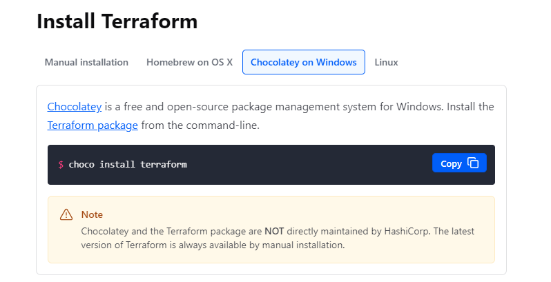
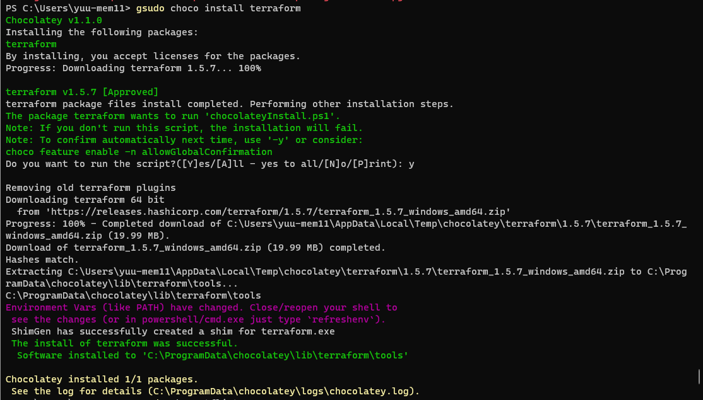
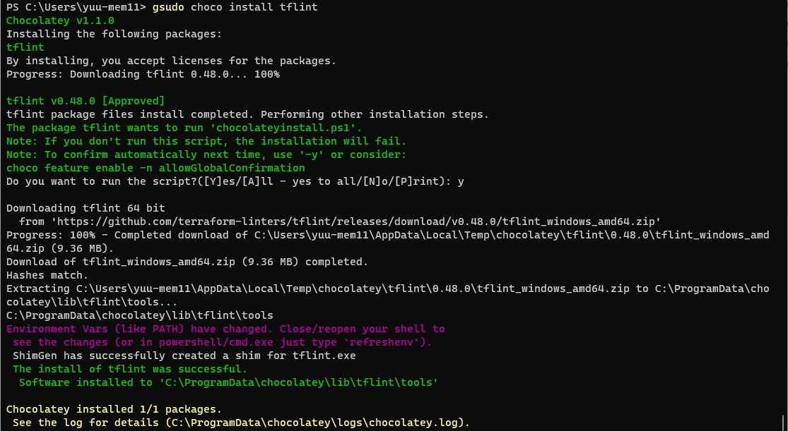
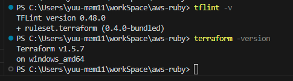
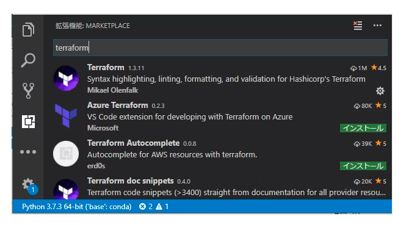

## AWSコース第13回課題「CircleCIにAnsilbleやServerSpecの処理を追加」

### terraformで環境構築
**terraformのインストール**
chocolateyを使用してインストール実施

**terraform拡張機能インストール**

### コンテナによるAnsilble実行環境の構築
**Docker for windowsを使用する**

‐ Docker for windowsのインストール
    
